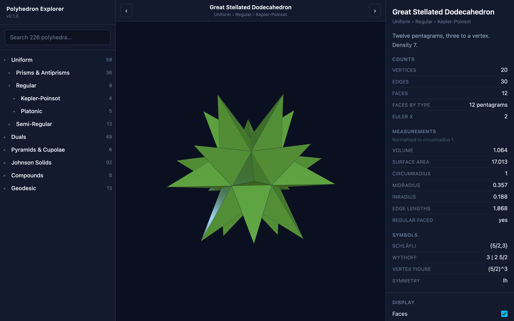

# Polyhedron Explorer

Browse and explore 308 famous polyhedra in 3D — on the desktop, on Android, or
in a browser. One React + Three.js codebase, wrapped in Tauri v2.

The catalog follows the category hierarchy used by
[Stella 4D / Great Stella](https://www.software3d.com/Manual/Builtin.php?prod=Great).

**[Try it in your browser →](https://alejandroechev.github.io/polyhedron-explorer/)**
&nbsp;·&nbsp;
**[Download the Android APK →](https://github.com/alejandroechev/polyhedron-explorer/releases/latest)**



## What's in the catalog

| Category | Models |
| --- | --- |
| Uniform › Regular › Platonic | 5 |
| Uniform › Regular › Kepler-Poinsot | 4 |
| Uniform › Semi-Regular › Archimedean | 13 |
| Uniform › Prisms & Antiprisms | 36 (n = 3…20) |
| Duals › Catalan | 13 |
| Duals › Bipyramids & Trapezohedra | 36 |
| Pyramids & Cupolae | 6 |
| Johnson Solids | 92 |
| Compounds | 8 |
| Stewart Toroids › Archimedean Rings | 12 |
| Stewart Toroids › Johnson Rings | 21 |
| Noble | 2 |
| Noble › Stephanoids | 47 |
| Geodesic › Spheres & Domes | 13 |

Plus a live **dual** of anything in the list, computed by polar reciprocation —
so the Catalan solids, the compound of five octahedra, and the duals of the
Johnson solids are all one tap away.

## Features

- Orbit / pinch-zoom 3D view with flat-shaded faces, edges and vertex markers.
- Colouring by face type, rainbow, hue-by-sides, or a single colour.
- Opacity and **explode** sliders for looking inside a model.
- Correct rendering of star faces: a pentagram is drawn as a five-pointed star,
  not as a filled pentagon.
- Toroids of genus 1 — the Stewart rings and the stephanoids — alongside the
  classical convex and star solids.
- Live metrics: V / E / F, Euler characteristic, genus, volume, surface area,
  circum-/mid-/in-radius, edge lengths, and the face-type breakdown.
- Schläfli, Wythoff and vertex-configuration symbols where they apply.
- Search across names, aliases, categories and symbols.
- Deep links: every model has its own URL hash (`#/truncated-icosahedron`).
- Responsive — a three-pane desktop layout, and a tabbed phone layout.

### Rupert passage

Enable **Show Rupert passage** in the display controls (the **options** tab on
phones) to watch an equal-sized copy pass through a hole in the selected solid.
The blue original has a cut-through tunnel with inner walls; the amber copy
travels through it and back on a continuous 12-second loop. Drag to orbit and
scroll or pinch to zoom, or use **Pause passage** to inspect a position.

The toggle becomes available only after a background search verifies strict
projection containment with positive clearance. All five Platonic solids are
covered; other closed convex models, including live duals, are checked using
their actual geometry. The search is bounded: **no passage found is not proof
that a solid lacks the Rupert property**. Non-convex models, stars and compounds
are not supported by this search.

Passage mode keeps both copies assembled and uses fixed colours; normal display
settings are restored when it is disabled. Reduced-motion preferences start the
passage paused. The construction uses the
[projection-containment criterion](https://chrisjones.id.au/Rupert/index.html).

## Running it

```bash
npm install
npm run dev          # web app on http://localhost:5173
npm run tauri dev    # desktop app
npm run build        # static web build into dist/
```

### Android

```bash
npx tauri android init
npx tauri android build          # release APK
npx tauri android dev            # on a connected device
```

CI builds a signed APK on every push to `main`; see
[`.github/workflows/build-android.yml`](.github/workflows/build-android.yml).
Artifacts are attached to the workflow run and to a GitHub release.

### Checks

```bash
npm run lint
npm test
npm run build && npm run test:e2e    # install Chromium first: npx playwright install chromium
npx tsx scripts/validate-catalog.ts   # builds and checks every model
```

## How it is put together

```
src/
  domain/
    geometry/      vector maths, polyhedron type, metrics, symmetry groups,
                   star-safe triangulation
    operations/    polyhedron → polyhedron transforms (currently: dual)
    catalog/       the registry, the category tree, search
      sources/     one module per family of models
  render/          Polyhedron → three.js objects
  ui/              React components and hooks
src-tauri/         the Tauri v2 shell (desktop + Android)
scripts/           catalog generation, icon generation, validation
```

The design point is that **everything is a source**. A `CatalogSource` returns
a list of `PolyhedronSpec`s, each of which builds its geometry lazily:

```ts
export const mySource: CatalogSource = {
  id: 'my-source',
  specs: () => [
    {
      id: 'my-polyhedron',
      name: 'My Polyhedron',
      categoryPath: ['Stellations', 'Icosahedron'],
      build: () => ({ vertices, faces }),
    },
  ],
}
```

Register it in `src/domain/catalog/index.ts` and it appears in the tree, in
search, in the info panel and in the 3D view with no other changes.

Operations are the second extension point. `dual()` is a
`(Polyhedron) => Polyhedron`; stellation, faceting, augmentation, truncation
and net unfolding all fit the same shape, which is the path towards the rest of
the Stella feature set.

### Planned

- The 53 non-convex uniform polyhedra via Wythoff construction.
- Stellation and faceting diagrams.
- Printable nets.
- Stewart toroids and noble polyhedra.

## Credits

Polyhedron data for the Platonic, Archimedean and Johnson solids comes from
George W. Hart's Encyclopedia of Polyhedra and is used on its non-commercial
terms — see [NOTICE](NOTICE). Everything else is generated by the code in this
repository.

## Licence

MIT, except for the third-party data described in [NOTICE](NOTICE).
